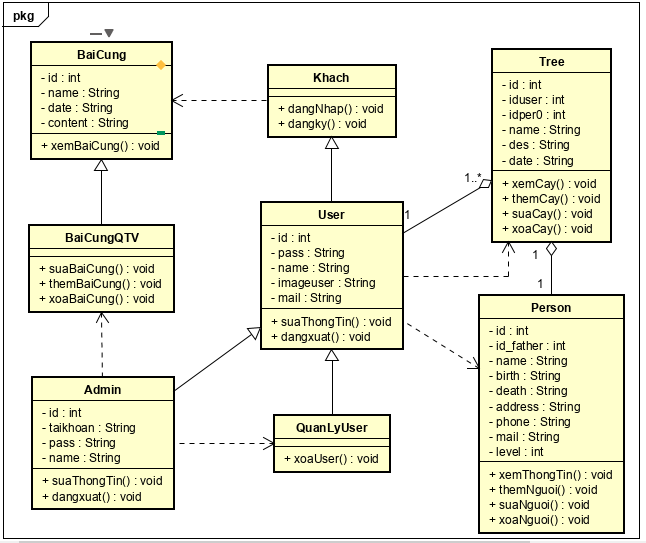

## Website xây dựng cây phả hệ
## IT48495 Công nghệ Web tiên tiến

## Danh sách thành viên

| Họ và tên | MSSV |
| --- | --- |
| Nguyễn Văn Đạt | 20154484 |
| Nguyễn Thành Luân | 20154483 |
| Nguyễn Hữu Tùng | 20154485 |
| Nguyễn Văn Đạt | 20160952 |

## Giới thiệu đề tài
- Dự án này được thực hiện trong học phần IT4895 Công nghệ Web tiên tiến 
do thầy Nguyễn Nhất Hải hướng dẫn.
- Tìm hiểu và giới thiệu về gia phả và cây phả hệ

## Các tính năng
- Xây dựng cây phả hệ
- Thêm sơ đồ phả hệ bằng nhiều cách
- Thêm, sửa, xóa người trong cây phả hệ
- Xem thông tin của từng người trong phả hệ như tên, tuổi, ngày sinh, 
ngày giỗ, vai trò,…
- Mục Bài Cúng để hướng dẫn cúng bái tổ tiên

## Công cụ sử dụng
- Ngôn ngữ lập trình: HTML, CSS, PHP
- Platform: Windows
- Framework: None
- Công cụ: Sublime Text 3
- Công nghệ: Git (Bitbucket)

## Phân tích thiết kế
- Biểu đồ usecase

- Biểu đồ tuần tự (trong báo cáo do số lượng lớn)
- Biểu đồ lớp 

- Thiết kế cơ sở dữ liệu

## Kiến trúc hệ thống
Hệ thống sử dụng mô hình MVC

## Cài đặt và sử dụng hệ thống
- Cài đặt [Xampp](https://www.apachefriends.org/index.html)
- Truy cập vào [localhost](http://localhost/webphahe/) để xem hệ thống
- Sử dụng tài khoản được cho phép ở dưới để thực hiện thêm một số tính 
năng

## Danh sách tài khoản được sử dụng của hệ thống
- user : nguyendatbk910@gmail.com 12345678
- admin : admin@admin.com qwerty

(trên gồm thông tin tài khoản và mật khẩu tương ứng)

## Kết luận
Mặc dù vẫn còn nhiều thiếu xót, nhưng nhóm đã cố gắng hoàn thành được dự 
án. Rất mong nhận được nhận xét vả bổ sung từ thầy và mọi người.

